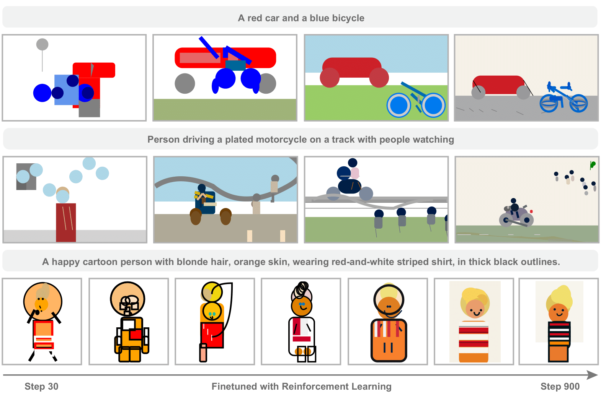

# Symbolic Graphics Programming with Large Language Models

<div align="center">
  
  <br>
  <sup><em>As training progresses, we can observe that the model acquires better
compositional drawing ability, producing semantically accurate symbolic graphics programs.</em></sup>
</div>

## Introduction

LLMs are strong at coding, but their ability to write symbolic graphics programs (SGPs) that render images (especially SVGs) is underexplored. This work studies text-to-SGP generation as a probe of visual generation, introducing SGP-GenBench to evaluate object-, scene-, and composition-level performance across open and proprietary models, revealing notable shortcomings. To improve results, we use reinforcement learning with rewards from visual–text similarity scores, which steadily enhances SVG quality and semantic alignment. Experiments show substantial gains, bringing performance close to state-of-the-art closed-source models.

## Installation

```bash
conda env create -n sgp_gen -f environment.yml

conda activate sgp_gen

pip install vllm==0.7.2 && pip install oat-llm==0.0.9

git clone git@github.com:Sphere-AI-Lab/SGP-RL.git

cd SGP-RL

pip install -e .

pip install cairosvg openai-clip lxml
```
We provide a requirements.txt recording the version informations for reference.


## Quick Start

### Prepare Datasets

#### Automatically Download All Required Data

We provide a script for automatically downloading all training and evaluation datasets:
```bash
bash prepare_data.sh
```

#### Manually Download datasets

Alternatively, you can also download the datasets manually.

##### Training Datasets


1) Setup COCO 2017 dataset(assume you put it in COCO_DIR):
```bash
export COCO_DIR=YOUR_COCO_DIR
cd "$COCO_DIR"
# Images
wget http://images.cocodataset.org/zips/train2017.zip
wget http://images.cocodataset.org/zips/val2017.zip

# Captions annotations
wget http://images.cocodataset.org/annotations/annotations_trainval2017.zip
unzip train2017.zip
unzip val2017.zip
unzip annotations_trainval2017.zip

```
You should have:
- train2017/
- val2017/
- annotations/
    - captions_train2017.json
    - captions_val2017.json
    ...

2) setup the svg training data:
download the dataset file at https://huggingface.co/datasets/SphereLab/SGP-Gen-70k/resolve/main/svg-gen-70k.jsonl

Put it into YOUR_SVG_DIR and setup environment variables:
```bash
export SVG_DIR=YOUR_SVG_DIR
```


##### SGP-Object Datasets (for evaluation)
Download SGP-Object dataset at  
https://huggingface.co/datasets/SphereLab/SGP-Object/resolve/main/SGP-Object.json

Put it into YOUR_SVG_DIR.


### RL Training

```bash
bash train_zero_svg.sh
```

### Evaluation on SGP-GenBench
Sampling model responses and calculating DINO-score, CLIP-score and Diversity on SGP-:
```bash
python evaluate_svg_model.py 
    --model_path YOUR_MODEL_PATH  
```
To get the VQA and HPS metrics, check [eval_tools](eval_tools/)

Evaluation on SGP-CompBench:
[sgp-compbench](sgp-compbench/)


## Acknowledgement
This code is based on [understand-r1-zero](https://github.com/sail-sg/understand-r1-zero).


## Citation

```python
PLACE HOLDER
```

