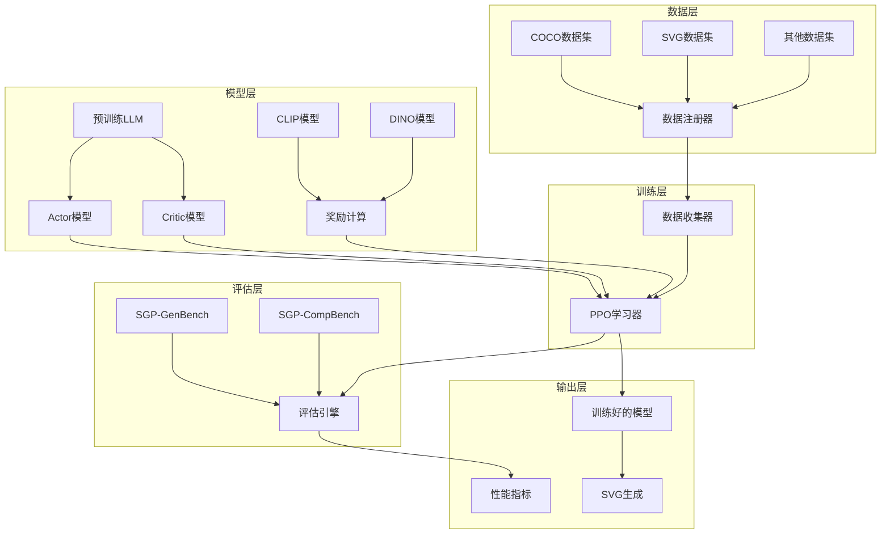
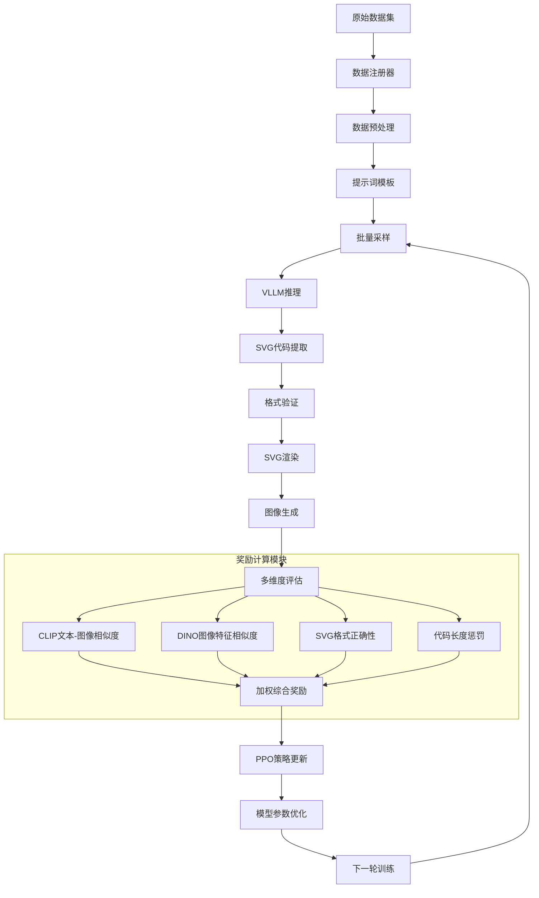
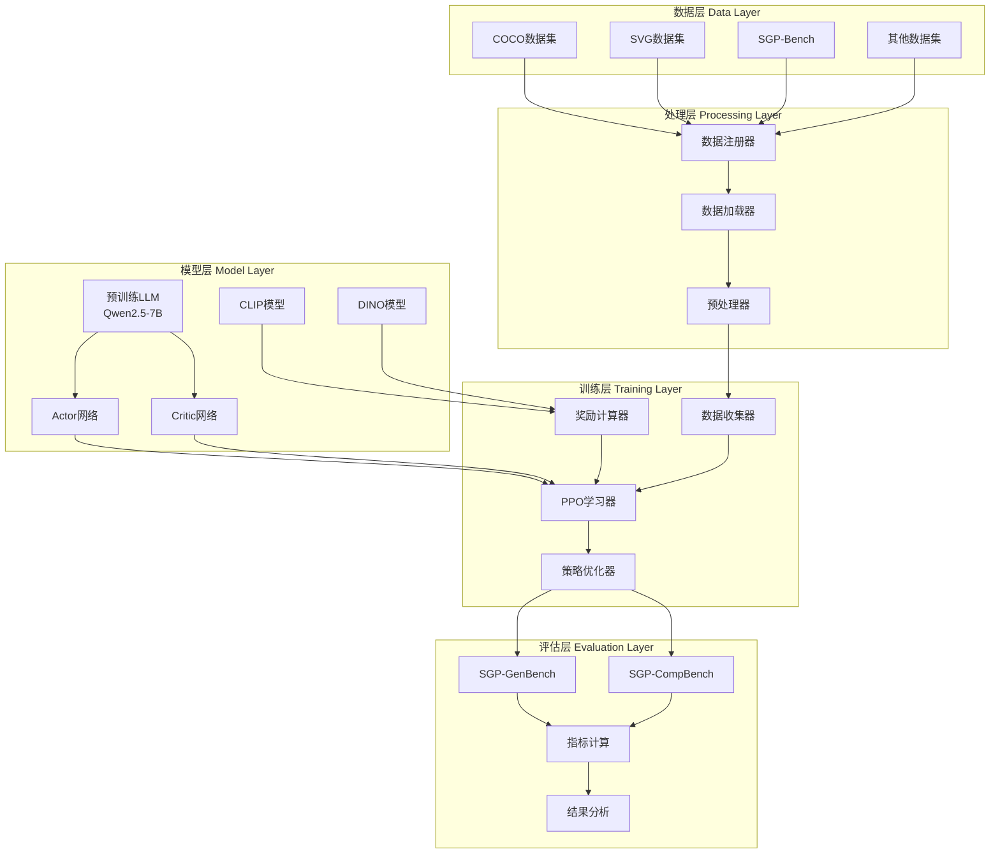
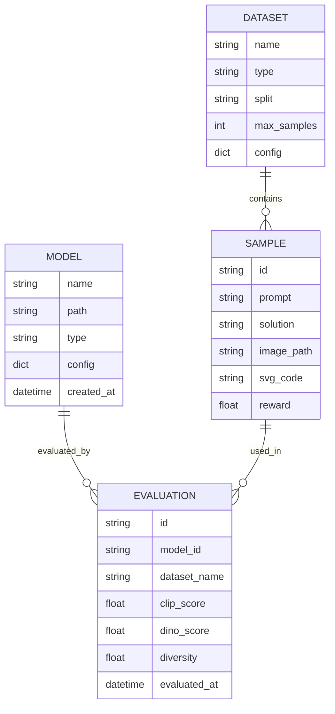

# SGP-RL 技术文档

## 目录
- [项目概述](#项目概述)
- [技术栈](#技术栈)
- [系统架构](#系统架构)
- [目录结构](#目录结构)
- [安装和运行指南](#安装和运行指南)
- [核心功能模块](#核心功能模块)
- [数据流程](#数据流程)
- [配置文件说明](#配置文件说明)
- [开发指南](#开发指南)
- [常见问题](#常见问题)

## 项目概述

SGP-RL（Symbolic Graphics Programming with Reinforcement Learning）是一个使用大语言模型（LLM）生成符号图形程序（特别是SVG代码）的研究项目。该项目通过强化学习技术提升模型生成高质量、语义准确的SVG图形的能力。

### 主要功能
- **文本到SVG生成**：根据自然语言描述生成对应的SVG代码
- **强化学习训练**：使用PPO算法优化模型性能
- **多维度评估**：通过CLIP、DINO等模型评估生成质量
- **基准测试**：提供SGP-GenBench和SGP-CompBench评估框架

### 研究意义
- 探索LLM在视觉生成任务中的能力边界
- 提供可解释的图形生成方法（相比于传统的图像生成）
- 为符号图形编程建立标准化评估体系

## 技术栈

### 核心框架
- **Python 3.10**：主要编程语言
- **PyTorch 2.5.1**：深度学习框架
- **VLLM 0.7.2**：高效的LLM推理引擎
- **OAT-LLM 0.0.9**：强化学习训练框架

### 机器学习相关
- **Transformers 4.48.2**：预训练模型加载和处理
- **Datasets 2.16.1**：数据集管理
- **Accelerate 1.5.2**：分布式训练加速
- **DeepSpeed 0.16.3**：大模型训练优化

### 图形处理
- **CairoSVG**：SVG渲染和转换
- **PIL (Pillow) 11.1.0**：图像处理
- **OpenCV 4.11.0**：计算机视觉操作

### 评估工具
- **OpenAI-CLIP 1.0.1**：文本-图像相似度评估
- **TorchVision 0.20.1**：视觉模型和变换
- **LXML 5.3.1**：XML/SVG解析

### 环境管理
- **Conda**：Python环境管理
- **CUDA 12.4**：GPU计算支持

## 系统架构



## 目录结构

```
SGP-RL/
├── README.md                    # 项目说明文档
├── requirements.txt             # Python依赖列表
├── environment.yml              # Conda环境配置
├── pyproject.toml              # 项目配置文件
├── Makefile                    # 构建脚本
├── LICENSE.txt                 # 开源许可证
│
├── train_zero_svg.py           # 主训练脚本
├── train_zero_svg.sh           # 训练启动脚本
├── evaluate_svg_model.py       # 模型评估脚本
├── prepare_data.sh             # 数据准备脚本
├── print_results.sh            # 结果打印脚本
├── visualize_metrics.py        # 指标可视化
├── extract_step_results.py     # 结果提取工具
├── eval_utils.py               # 评估工具函数
│
├── understand_r1_zero/         # 核心模块包
│   ├── __init__.py
│   ├── __about__.py            # 版本信息
│   ├── args.py                 # 参数配置
│   ├── actor.py                # Actor模型实现
│   ├── learner.py              # 学习器实现
│   ├── collector.py            # 数据收集器
│   ├── dataset.py              # 数据集处理
│   ├── oracle.py               # 奖励预言机
│   ├── svg.py                  # SVG处理工具
│   ├── svg_grader.py           # SVG评分器
│   ├── clips.py                # CLIP模型工具
│   └── math_grader.py          # 数学评分器
│
├── dataset/                    # 数据集模块
│   ├── __init__.py
│   ├── registry.py             # 数据集注册器
│   ├── dataset.py              # 基础数据集类
│   ├── reward.py               # 奖励计算
│   ├── utils/                  # 数据处理工具
│   ├── coco/                   # COCO数据集
│   ├── coco_image/             # COCO图像数据集
│   ├── coco_mix/               # 混合数据集
│   ├── instruct_svg/           # 指令SVG数据集
│   ├── haoquan_svg/            # HaoQuan SVG数据集
│   ├── sgp_bench/              # SGP基准数据集
│   ├── simple_object/          # 简单对象数据集
│   ├── simple_relation/        # 简单关系数据集
│   └── [其他数据集]/
│
├── sgp-compbench/              # SGP组合基准测试
│   ├── main.py                 # 主评估脚本
│   ├── generation.py           # SVG生成
│   ├── evaluation.py           # 评估逻辑
│   ├── analysis.py             # 结果分析
│   ├── util.py                 # 工具函数
│   ├── evaluation_prompts.py   # 评估提示词
│   ├── requirements.txt        # 依赖列表
│   ├── readme.md               # 使用说明
│   └── prompts/                # 提示词模板
│
├── eval_tools/                 # 评估工具集
│   ├── README.md               # 工具说明
│   ├── eval_hpsv2.py           # HPS评估
│   ├── eval_vqa_tifa.py        # VQA评估
│   ├── get_id2img.py           # 图像ID映射
│   ├── build_vqa/              # VQA构建工具
│   └── tifa/                   # TIFA评估框架
│
├── examples/                   # 示例脚本
│   ├── coco_mix.sh             # COCO混合数据训练
│   ├── qwen2.5-svg-7b.sh       # Qwen模型训练
│   ├── scale_rewards_*.sh      # 奖励缩放实验
│   └── [其他示例]/
│
├── analysis/                   # 分析工具
│   ├── answering_ability.py    # 回答能力分析
│   ├── keyword_count.py        # 关键词统计
│   └── sr_detection.py         # 成功率检测
│
├── assets/                     # 资源文件
│   ├── teaser.png              # 项目展示图
│   └── teaser.pdf              # 项目介绍PDF
│
└── deploy_dpsk/                # 部署相关
    └── serving.sh              # 服务启动脚本
```

## 安装和运行指南

### 环境要求

- **操作系统**：Linux（推荐Ubuntu 20.04+）
- **Python版本**：3.10
- **CUDA版本**：12.4+
- **GPU内存**：建议32GB+（用于7B模型训练）
- **系统内存**：建议64GB+

### 安装步骤

#### 1. 创建Conda环境

```bash
# 克隆项目
git clone https://github.com/Sphere-AI-Lab/SGP-RL.git
cd SGP-RL

# 创建并激活环境
conda env create -n sgp_gen -f environment.yml
conda activate sgp_gen
```

#### 2. 安装Python依赖

```bash
# 安装核心依赖
pip install vllm==0.7.2 && pip install oat-llm==0.0.9

# 安装项目
pip install -e .

# 安装额外依赖
pip install cairosvg openai-clip lxml
```

#### 3. 准备数据集

**自动下载（推荐）**：
```bash
bash prepare_data.sh
```

**手动下载**：
```bash
# 设置COCO数据集路径
export COCO_DIR=YOUR_COCO_DIR
cd "$COCO_DIR"

# 下载COCO图像
wget http://images.cocodataset.org/zips/train2017.zip
wget http://images.cocodataset.org/zips/val2017.zip
wget http://images.cocodataset.org/annotations/annotations_trainval2017.zip

# 解压
unzip train2017.zip && unzip val2017.zip && unzip annotations_trainval2017.zip

# 下载SVG训练数据
export SVG_DIR=YOUR_SVG_DIR
cd "$SVG_DIR"
wget https://huggingface.co/datasets/SphereLab/SGP-Gen-70k/resolve/main/svg-gen-70k.jsonl

# 下载SGP-Object评估数据
wget https://huggingface.co/datasets/SphereLab/SGP-Object/resolve/main/SGP-Object.json
```

### 快速开始

#### 1. 训练模型

```bash
# 使用默认配置开始训练
bash train_zero_svg.sh

# 或者使用自定义参数
python train_zero_svg.py \
    --critic_type grpo \
    --gpus 8 \
    --pretrain Qwen/Qwen2.5-7B \
    --prompt_template r1_svg \
    --learning_rate 0.000001 \
    --train_batch_size 128
```

#### 2. 评估模型

```bash
# 在SGP-GenBench上评估
python evaluate_svg_model.py --model_path YOUR_MODEL_PATH

# 打印结果
bash print_results.sh

# 在SGP-CompBench上评估
cd sgp-compbench
python main.py --model YOUR_MODEL_NAME
```

## 核心功能模块

### 1. 强化学习训练模块

**位置**：`understand_r1_zero/learner.py`

这是项目的核心训练模块，实现了基于PPO的强化学习算法：

```python
class ZeroSVGLearner(PPOLearner):
    def _init(self, args: ZeroSVGArgs, actors: List[ActorBase]) -> None:
        # 初始化PPO学习器
        # 设置数据收集器和奖励计算
```

**主要功能**：
- 实现PPO（Proximal Policy Optimization）算法
- 支持分布式训练
- 集成多种奖励信号（CLIP、DINO、长度、格式）
- 提供梯度检查点和内存优化

### 2. Actor模型模块

**位置**：`understand_r1_zero/actor.py`

Actor模型负责生成SVG代码并计算奖励：

```python
class ZeroSVGActor(PPOActor):
    def __init__(self, ipc_server, vllm_args, args: ZeroSVGArgs) -> None:
        # 初始化Actor模型
        # 设置SVG和数学预言机
```

**主要功能**：
- 基于VLLM的高效推理
- 集成多种奖励模型
- 支持批量生成和评估

### 3. 数据集管理模块

**位置**：`dataset/registry.py`

统一管理多种数据集的加载和处理：

```python
DATASETS = {
    "coco": COCODataset,
    "instruct_svg": InstructSVGDataset,
    "sgp_bench": SGPBenchDataset,
    # ... 更多数据集
}
```

**支持的数据集**：
- **COCO**：图像描述数据集
- **InstructSVG**：指令式SVG数据集
- **SGP-Bench**：符号图形编程基准
- **HaoQuan SVG**：高质量SVG数据集

### 4. SVG处理模块

**位置**：`understand_r1_zero/svg.py`, `understand_r1_zero/svg_grader.py`

处理SVG代码的解析、渲染和评估：

```python
def extract_svg(text: str) -> str:
    """从文本中提取SVG代码"""
    
def safe_svg_to_image(svg_content: str) -> Image:
    """安全地将SVG转换为图像"""
```

**主要功能**：
- SVG代码提取和验证
- SVG到图像的渲染
- 格式检查和错误处理
- 风格检测（素描、灰度等）

### 5. 奖励计算模块

**位置**：`understand_r1_zero/oracle.py`

实现多维度的奖励计算：

```python
class SVGOracle:
    def __init__(self, rewards_dict, models_dict, offset, args):
        # 初始化奖励模型
        # CLIP、DINO、长度、格式奖励
```

**奖励类型**：
- **CLIP奖励**：文本-图像语义相似度
- **DINO奖励**：图像特征相似度  
- **长度奖励**：控制生成长度
- **格式奖励**：SVG格式正确性

### 6. 评估框架

#### SGP-GenBench
**位置**：`evaluate_svg_model.py`

提供标准化的模型评估：
- DINO分数：图像特征相似度
- CLIP分数：文本-图像匹配度
- 多样性指标：生成内容的多样性
- VQA分数：视觉问答准确性

#### SGP-CompBench  
**位置**：`sgp-compbench/`

专门评估组合能力：
- **属性绑定**：颜色、形状、纹理绑定
- **关系理解**：2D、3D、隐式关系
- **数量推理**：对象计数和绑定

## 数据流程

### 训练数据流程图



### 组件关系图



### 详细流程说明

#### 1. 数据准备阶段
- **数据集注册**：通过`dataset/registry.py`统一管理多种数据集
- **数据加载**：使用HuggingFace Datasets库加载训练数据
- **数据预处理**：标准化文本描述，构建训练样本对
- **批次构建**：根据配置的批次大小组织训练数据

#### 2. 模型推理阶段
- **提示词模板**：使用`r1_svg`模板格式化输入
- **VLLM推理**：高效的批量推理，支持并行处理
- **输出解析**：从模型生成的文本中提取SVG代码
- **格式验证**：检查SVG代码的语法正确性

#### 3. 奖励计算阶段
- **SVG渲染**：使用CairoSVG将代码转换为图像
- **CLIP评分**：计算文本描述与生成图像的语义相似度
- **DINO评分**：使用视觉特征评估图像质量
- **格式奖励**：根据SVG代码格式正确性给分
- **长度惩罚**：控制生成代码的长度合理性

#### 4. 策略优化阶段
- **优势估计**：计算每个动作的优势函数
- **策略梯度**：使用PPO算法计算策略梯度
- **价值函数更新**：同时优化Critic网络
- **参数更新**：应用梯度更新模型参数

### 数据库模型图（如适用）



## 配置文件说明

### 主要配置参数

**位置**：`understand_r1_zero/args.py`

```python
@dataclass
class ZeroSVGArgs(PPOArgs):
    # 模型配置
    pretrain: str = "Qwen/Qwen2.5-7B"          # 预训练模型
    prompt_template: str = "r1_svg"             # 提示词模板
    
    # 训练配置
    learning_rate: float = 0.000001             # 学习率
    train_batch_size: int = 128                 # 训练批次大小
    num_ppo_epochs: int = 1                     # PPO训练轮数
    
    # 奖励配置
    clip_coeff: float = 1.0                     # CLIP奖励系数
    dino_coeff: float = 1.0                     # DINO奖励系数
    length_coeff: float = 0.0                   # 长度奖励系数
    format_coeff: float = 0.0                   # 格式奖励系数
    
    # 生成配置
    generate_max_length: int = 3000             # 最大生成长度
    temperature: float = 1.0                    # 采样温度
    top_p: float = 1.0                          # 核采样参数
```

### 环境变量

```bash
# 数据集路径
export COCO_DIR=/path/to/coco/dataset
export SVG_DIR=/path/to/svg/dataset

# CUDA设置
export CUDA_VISIBLE_DEVICES=0,1,2,3,4,5,6,7

# 分布式训练
export MASTER_ADDR=localhost
export MASTER_PORT=29500
```

## 开发指南

### 添加新数据集

1. **创建数据集类**：
```python
# dataset/your_dataset/dataset.py
class YourDataset:
    @staticmethod
    def load_dataset(dataset_name, **kwargs):
        # 实现数据加载逻辑
        pass
    
    @staticmethod  
    def process_example(example):
        # 实现数据预处理逻辑
        pass
```

2. **注册数据集**：
```python
# dataset/registry.py
from .your_dataset.dataset import YourDataset

DATASETS = {
    # ... 现有数据集
    "your_dataset": YourDataset,
}
```

### 自定义奖励函数

```python
# understand_r1_zero/oracle.py
class CustomReward:
    def __init__(self, **kwargs):
        # 初始化自定义奖励
        pass
    
    def __call__(self, responses, prompts, **kwargs):
        # 实现奖励计算逻辑
        return rewards
```

### 最佳实践

1. **内存管理**：
   - 使用梯度检查点减少内存使用
   - 适当设置批次大小避免OOM
   - 使用混合精度训练（bf16）

2. **分布式训练**：
   - 合理设置GPU数量和分配
   - 使用DeepSpeed ZeRO优化大模型训练
   - 监控各GPU负载均衡

3. **实验管理**：
   - 使用Weights & Biases记录实验
   - 定期保存检查点
   - 记录重要超参数和结果

## 常见问题

### Q1: 训练时出现CUDA内存不足怎么办？

**解决方案**：
```bash
# 减少批次大小
--train_batch_size 64 --rollout_batch_size 64

# 启用梯度检查点
--gradient-checkpointing

# 使用混合精度
--bf16

# 调整VLLM GPU占用比例
--vllm_gpu_ratio 0.3
```

### Q2: SVG渲染失败率高怎么办？

**解决方案**：
1. 检查SVG格式奖励权重：`--format_coeff 1.0`
2. 增加格式检查的严格程度
3. 使用更多高质量的SVG训练数据
4. 调整生成长度限制

### Q3: 如何调试模型生成质量？

**调试步骤**：
1. 检查生成的SVG代码格式
2. 可视化渲染结果
3. 分析各项奖励分数
4. 对比不同检查点的性能

### Q4: 分布式训练不稳定怎么办？

**解决方案**：
```bash
# 设置更稳定的启动方式
--launch_type local_mp

# 调整通信后端
export NCCL_DEBUG=INFO

# 使用更小的学习率
--learning_rate 0.0000005
```

### Q5: 评估结果不理想怎么办？

**优化建议**：
1. 增加训练数据的多样性
2. 调整奖励函数权重平衡
3. 使用更强的基础模型
4. 延长训练时间和步数

### Q6: 如何监控训练进度？

**监控方法**：
```bash
# 使用Weights & Biases
--use-wb --wb_project your_project --wb-run-name your_run

# 查看训练日志
tail -f logs/training.log

# 监控GPU使用情况
nvidia-smi -l 1
```

### Q7: 如何进行模型推理和部署？

**推理示例**：
```python
from vllm import LLM, SamplingParams

# 加载模型
llm = LLM(model="path/to/your/model")

# 设置采样参数
sampling_params = SamplingParams(
    temperature=1.0,
    top_p=1.0,
    max_tokens=3000
)

# 生成SVG
prompt = "Please write SVG code for: a red circle"
outputs = llm.generate([prompt], sampling_params)
```

## API接口文档

### 核心API接口

#### 1. 数据集加载接口

```python
from dataset.registry import get_dataset_class

# 获取数据集类
dataset_class = get_dataset_class("coco_mix")

# 加载数据集
dataset = dataset_class.load_dataset(
    dataset_name="coco_mix",
    max_train_samples=10000,
    max_test_samples=1000
)
```

#### 2. 模型训练接口

```python
from understand_r1_zero.learner import ZeroSVGLearner
from understand_r1_zero.actor import ZeroSVGActor
from understand_r1_zero.args import ZeroSVGArgs

# 配置参数
args = ZeroSVGArgs(
    pretrain="Qwen/Qwen2.5-7B",
    learning_rate=1e-6,
    train_batch_size=128
)

# 启动训练
program, local_resources = get_program(
    args, learner_cls=ZeroSVGLearner, actor_cls=ZeroSVGActor
)
```

#### 3. 评估接口

```python
from understand_r1_zero.svg_grader import calculate_eval_rewards

# 计算评估奖励
rewards = calculate_eval_rewards(
    model_responses=responses,
    prompts=prompts,
    models_dict={'clip': ['clip_small'], 'dino': ['dino_small']}
)
```

#### 4. SVG处理接口

```python
from understand_r1_zero.svg import extract_svg, safe_svg_to_image

# 提取SVG代码
svg_code = extract_svg(model_output)

# 渲染为图像
image = safe_svg_to_image(svg_code)
```

## 性能优化指南

### 1. 内存优化

```bash
# 启用梯度检查点
--gradient-checkpointing

# 使用混合精度训练
--bf16

# 调整VLLM内存占用
--vllm_gpu_ratio 0.3

# 使用DeepSpeed ZeRO
--zero-stage 2 --ref_offload
```

### 2. 计算优化

```bash
# 启用Flash Attention
--flash-attn

# 使用前缀缓存
--enable_prefix_caching

# 并行处理
--collocate --vllm_sleep
```

### 3. 分布式优化

```bash
# 多GPU训练
--gpus 8

# 调整批次大小
--train_batch_size_per_device 1
--rollout_batch_size_per_device 16

# 设置通信后端
export NCCL_SOCKET_IFNAME=eth0
```

## 学习资源

### 相关论文
- [Symbolic Graphics Programming with Large Language Models](https://arxiv.org/abs/2509.05208)
- [Proximal Policy Optimization Algorithms](https://arxiv.org/abs/1707.06347)
- [CLIP: Learning Transferable Visual Representations](https://arxiv.org/abs/2103.00020)
- [DINOv2: Learning Robust Visual Features](https://arxiv.org/abs/2304.07193)

### 技术文档
- [VLLM Documentation](https://docs.vllm.ai/)
- [PyTorch Documentation](https://pytorch.org/docs/)
- [Hugging Face Transformers](https://huggingface.co/docs/transformers/)
- [DeepSpeed Documentation](https://deepspeed.readthedocs.io/)

### 开源项目
- [OAT-LLM](https://github.com/sail-sg/oat-llm)
- [Understand R1 Zero](https://github.com/sail-sg/understand-r1-zero)
- [VLLM](https://github.com/vllm-project/vllm)

### 社区资源
- [Hugging Face Hub](https://huggingface.co/)
- [Papers With Code](https://paperswithcode.com/)
- [Reddit r/MachineLearning](https://reddit.com/r/MachineLearning)

---

## 贡献指南

### 如何贡献

1. **Fork项目**：在GitHub上fork本项目
2. **创建分支**：`git checkout -b feature/your-feature`
3. **提交更改**：`git commit -am 'Add some feature'`
4. **推送分支**：`git push origin feature/your-feature`
5. **创建PR**：在GitHub上创建Pull Request

### 代码规范

- 遵循PEP 8 Python代码规范
- 添加适当的文档字符串
- 编写单元测试
- 确保代码通过CI检查

### 问题报告

请在GitHub Issues中报告问题，包含：
- 详细的错误描述
- 复现步骤
- 环境信息
- 相关日志

---

*本文档持续更新中，如有问题请提交Issue或联系项目维护者。*

**最后更新时间**：2025年9月
**文档版本**：v1.0
**项目版本**：基于最新main分支
